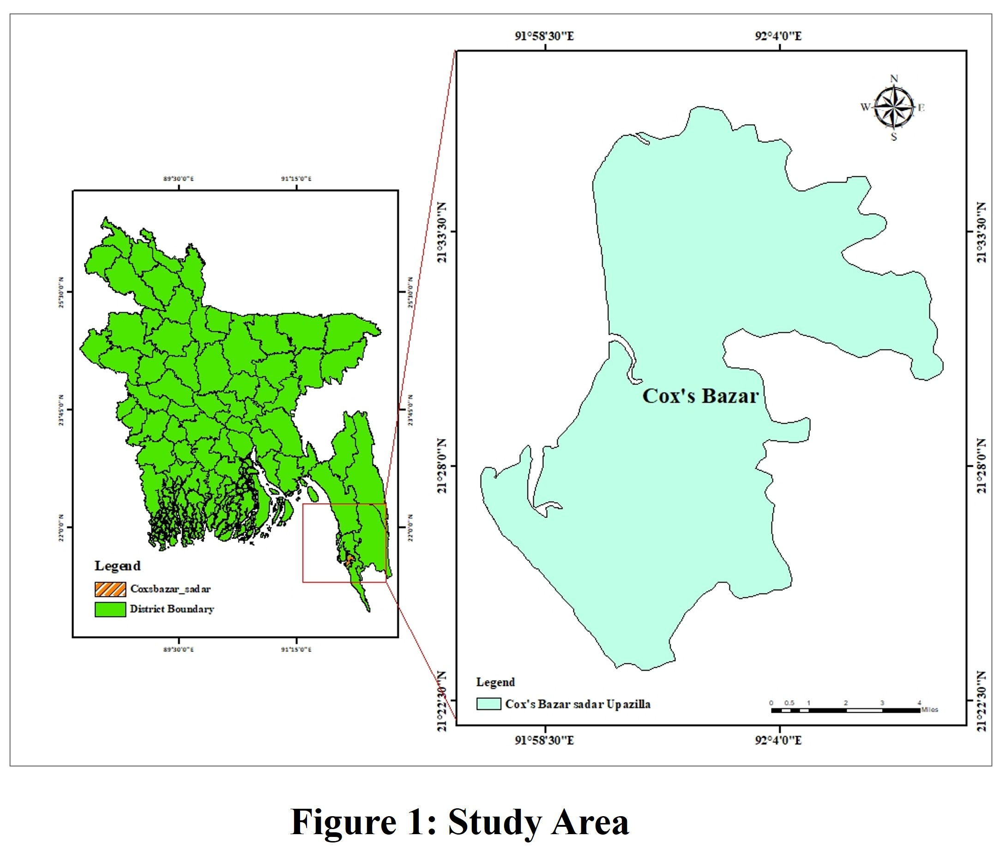
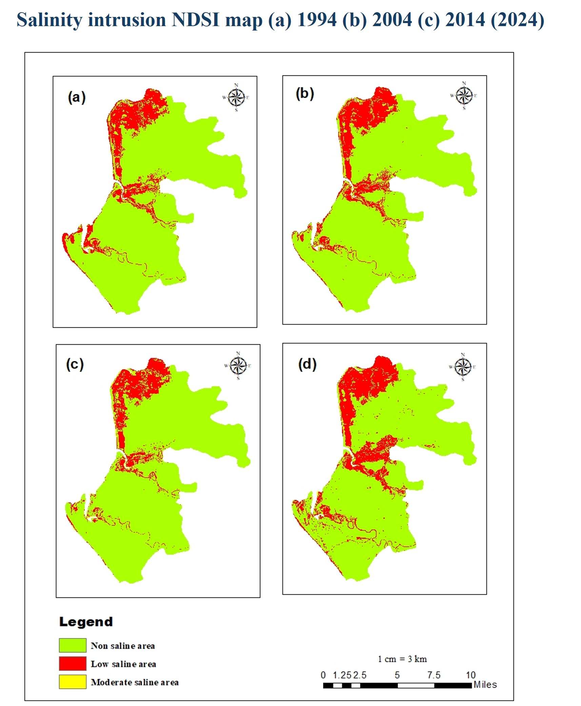
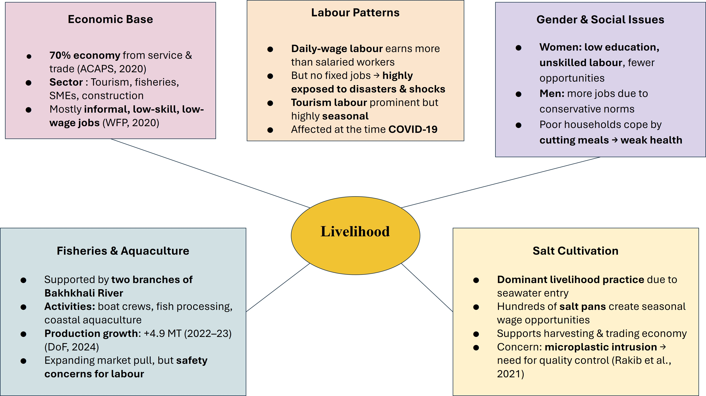

## <i>**📘 Project:** Proposing appropriate and site-specific adaptations due to climate change in a selected coastal area of Bangladesh</i>  

  
<b>📠Project Description</b>  
Bangladesh’s coastal regions, especially Cox’s Bazar, are highly vulnerable to climate change induced hazards such as sea-level rise, salinity intrusion, shifting erosion-accretion patterns, and recurrent storm surges. These environmental challenges threaten the livelihoods, infrastructure, and natural resources of coastal communities. This study explores the vulnerability of Cox’s Bazar Sadar Upazila to these climate impacts and proposes site-specific adaptation strategies to enhance resilience. The research utilizes remote sensing data and standardized indices like the Normalized Differential Salinity Index (NDSI) to assess salinity intrusion and erosion-accretion dynamics. The findings highlight the significant risks posed by sea-level rise and storm surges, particularly the impact of Cyclone Sidr in 2007. Adaptation measures such as ecosystem-based solutions, strengthening early warning systems, and diversifying livelihoods are recommended to mitigate the risks and enhance community resilience in the face of ongoing climate change. 

 

  

 

---

    
 

 

    
 

 
 ## 📊 Results

    
 

 

    
 

 

    
 

    
 

 

    
 

  

🌊 Key Adaptation Themes:

- **Sea-Level Rise** → Coastal setback policies, upgraded embankments, hybrid defenses with mangroves and dunes.
- **Erosion–Accretion** → Shoreline monitoring, beach nourishment, dune stabilization, low-crested offshore breakwaters.
- **Salinity Intrusion** → Managed aquifer recharge, salt-tolerant crops, raised-bed farming, rainwater harvesting, mangrove regeneration.
- **Storm Surge & Cyclones** → Early warning systems, cyclone-resilient shelters, mangrove buffers, tidal wetland expansion.
- **Resource Safeguards** → Reef rehabilitation, restrictions on unregulated dredging & reclamation.
- **Livelihoods** → Eco-tourism, sustainable aquaculture, microfinance, insurance, skill development, seasonal migration.
- **Governance** → Risk-sensitive land-use codes, participatory resource management, resettlement frameworks.
- **Policy Relevance** → Pilot greenbelt and TRM projects, scenario-based planning for sea-level and cyclone intensification.
 

