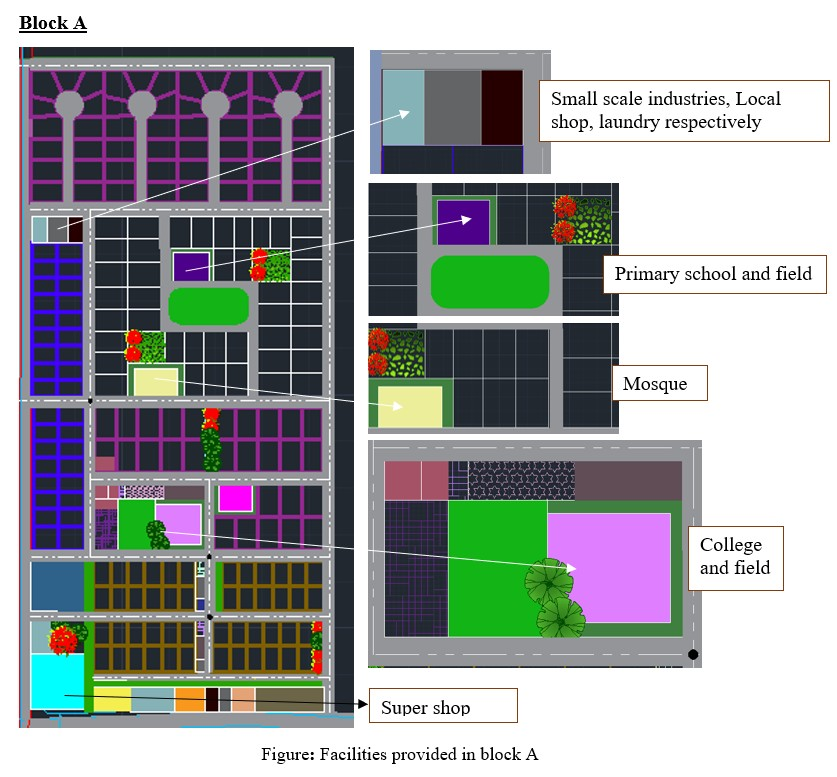
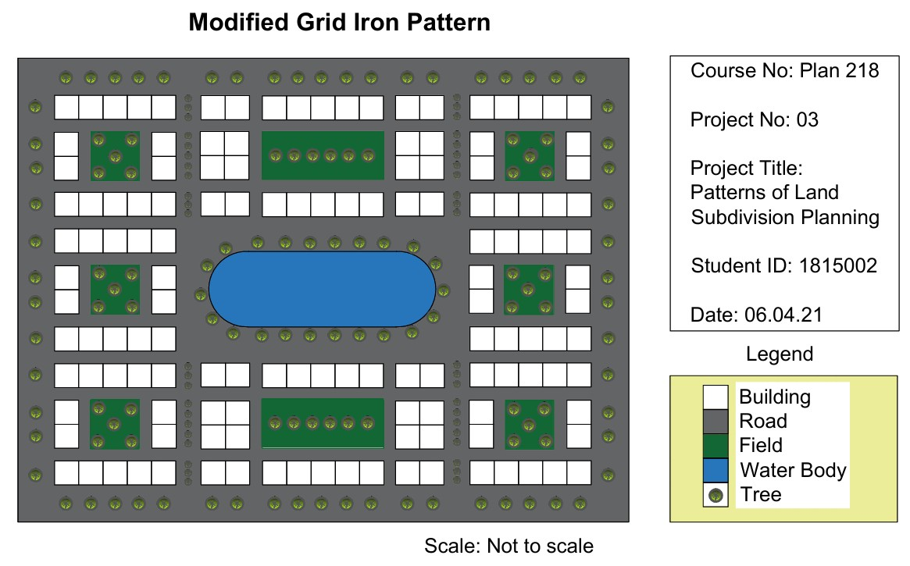
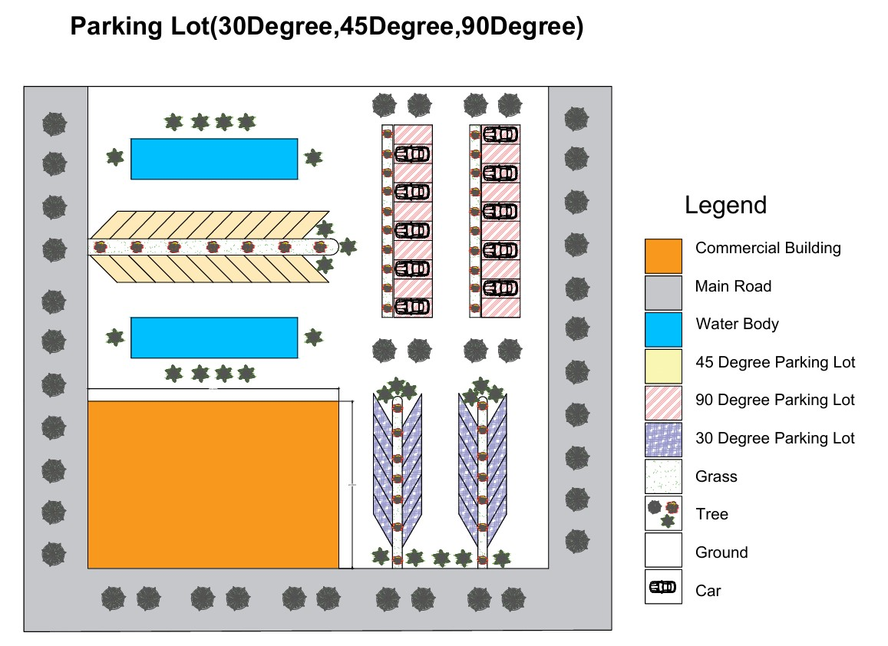

## <i>**🧾Project:** Neighborhood Plan of an Residential Area</i>  
 

    
  

    
  

    
  

    
  

    
  

    
  

    
  

    
  

    
  

 

  

## <i>**🧾Project:** Patterns of Land Subdivision </i>  

    
  

    
  

    
  

 

## <i>**🧾Project:** Design of Parking Lot </i>  

    
  

    
  

