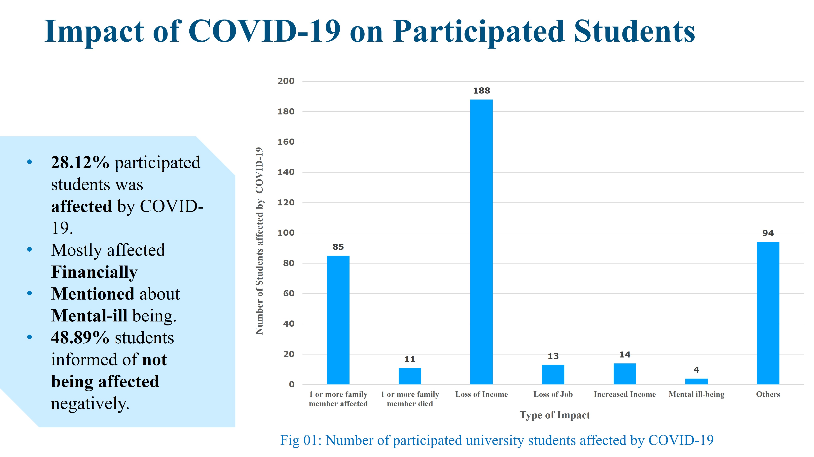
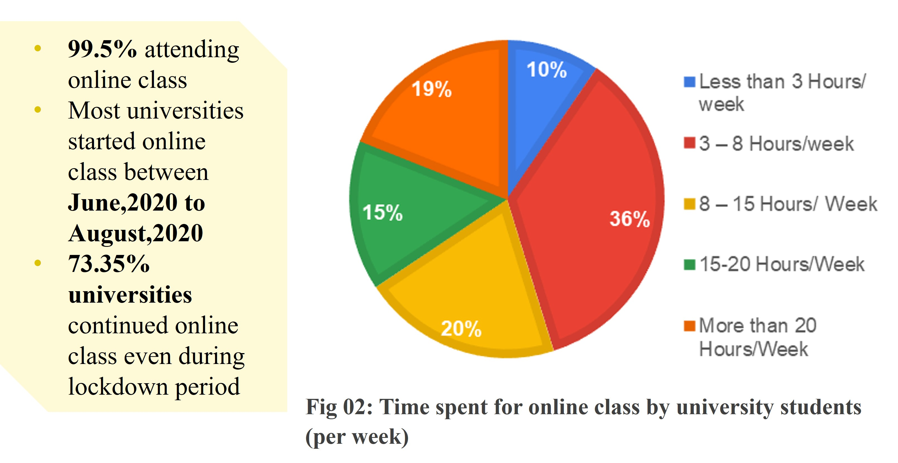
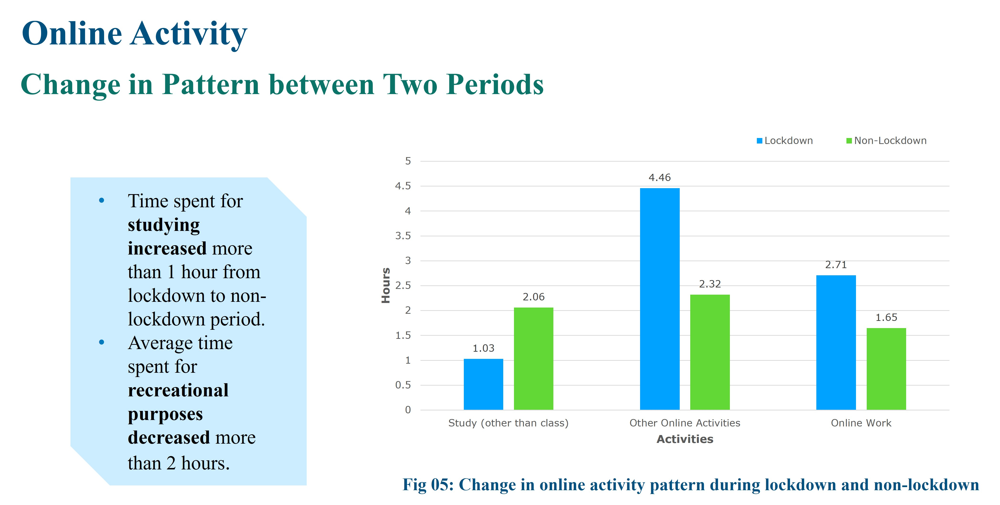
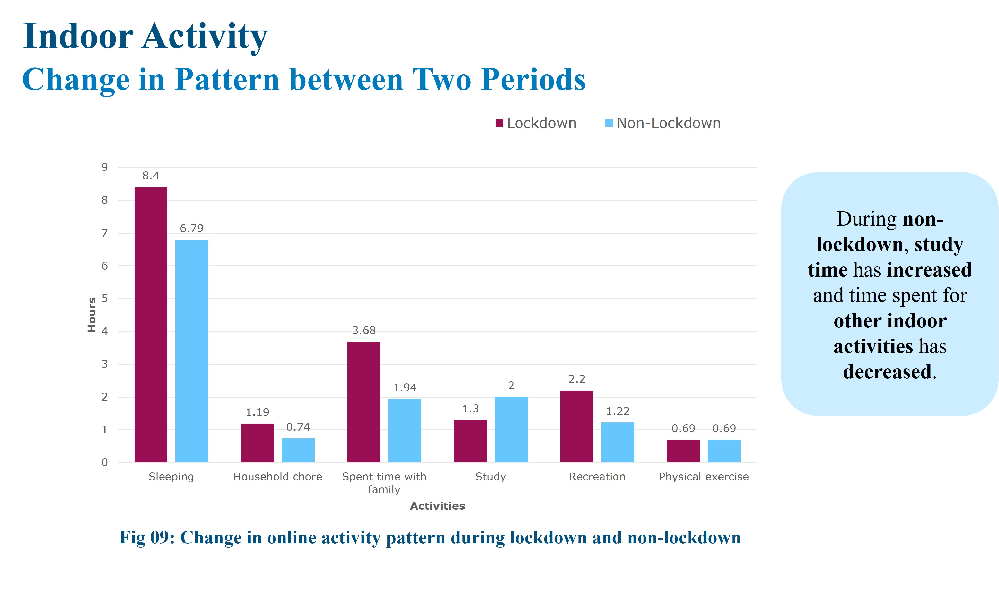
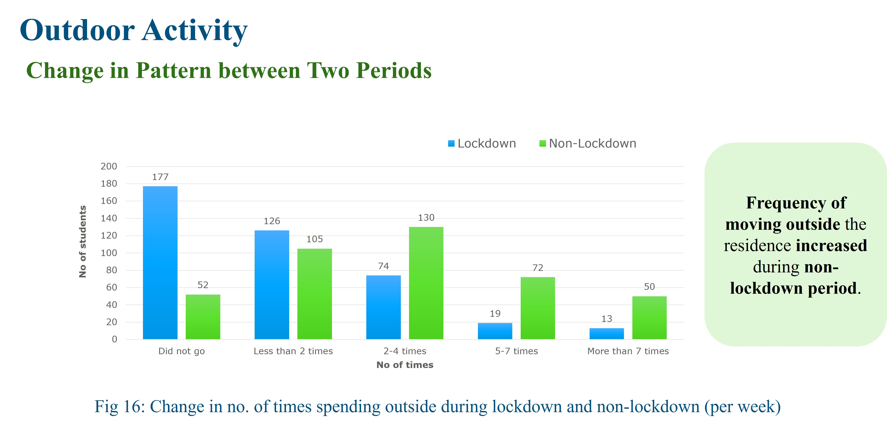
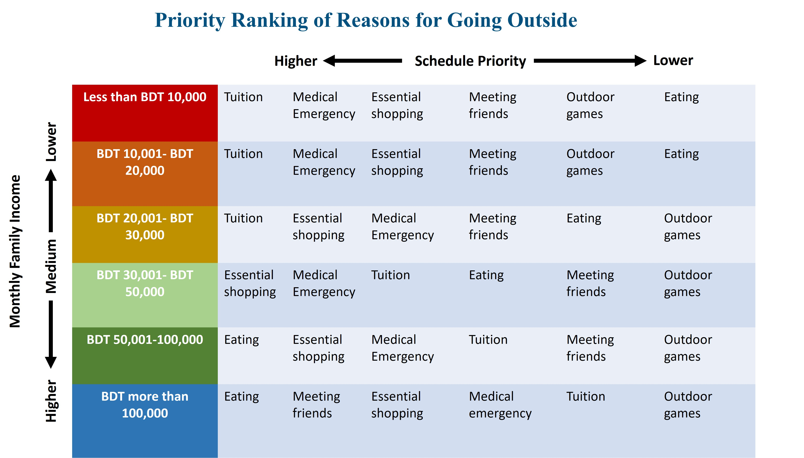

## <i>📝 Project: A Study on Activity Pattern of University Students during Covid-19 Pandemic in Bangladesh </i>  

**🎯 Objective**
1. To identify the general activities of the university students of Bangladesh during the non-lock down period due to enforced closer of universities.
2. To identify the activities performed by the university students of Bangladesh during the enforced lockdown due to COVID-19. 
3. To find out the relationships (if any) between activities and socio-economic condition.

  

  

## 📊 Result
  

    
  

 

    
  

  

    
  

   

    
  

   

    
  

  

    
  

   

