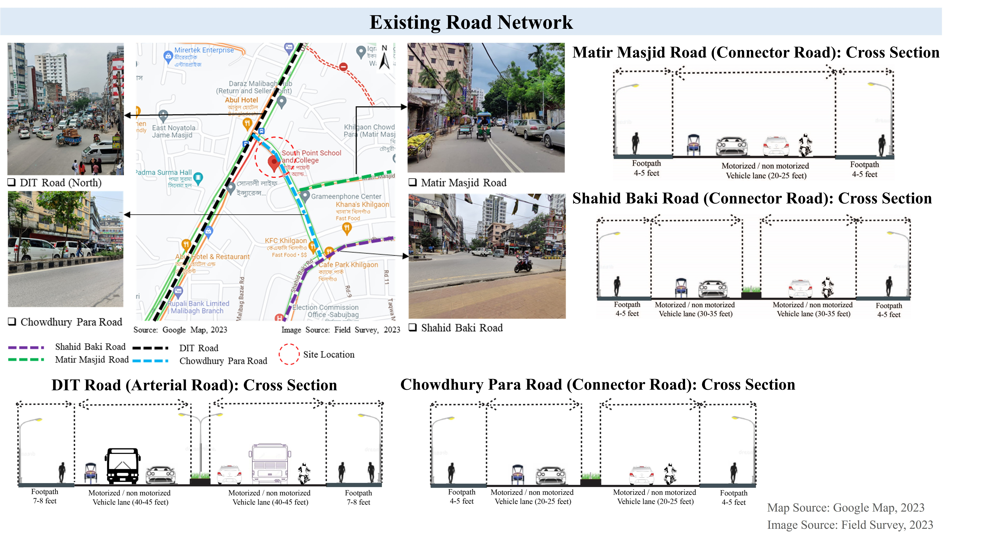
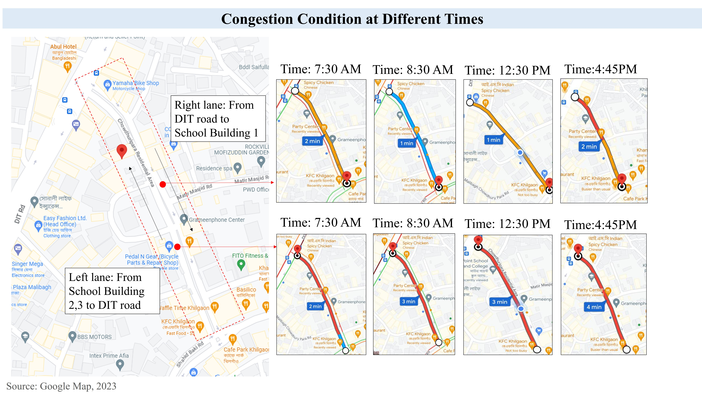
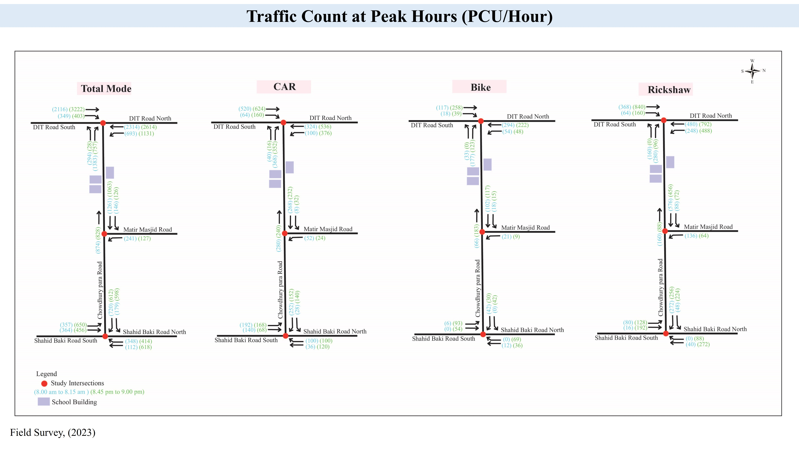
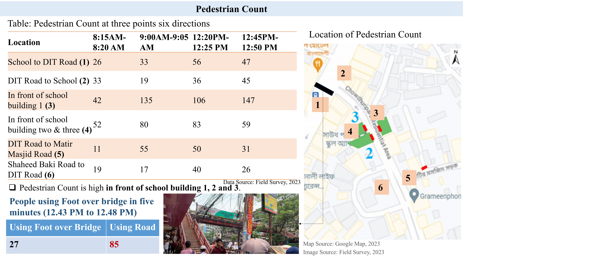
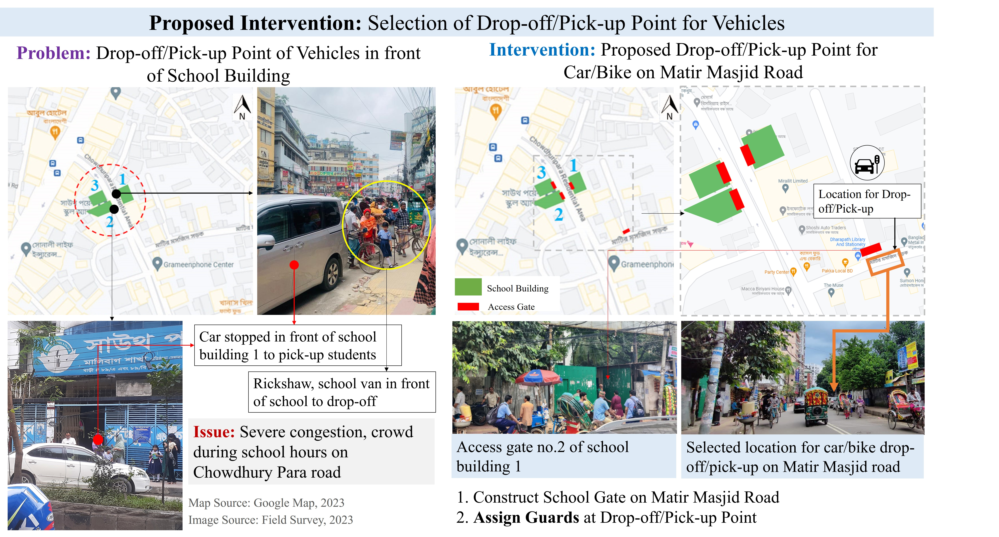
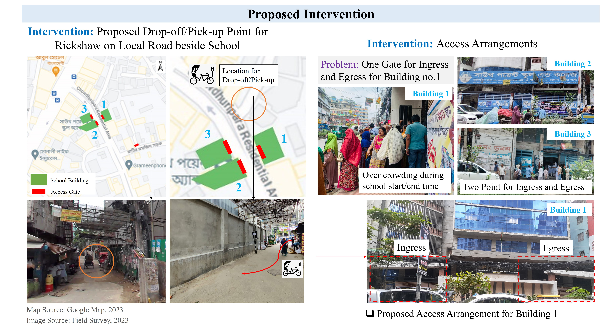
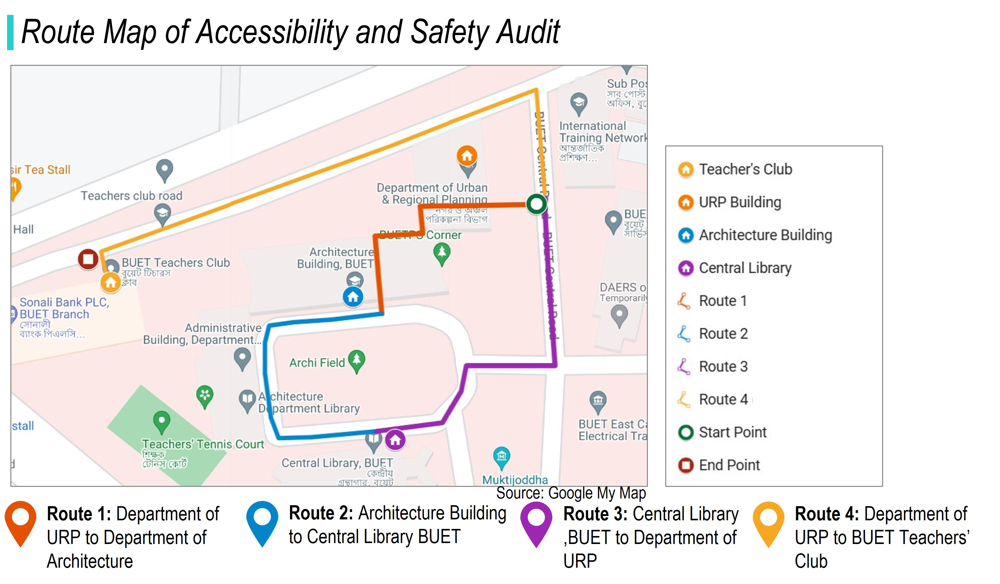
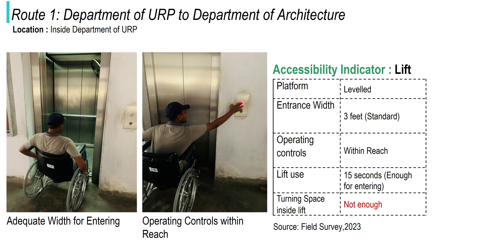
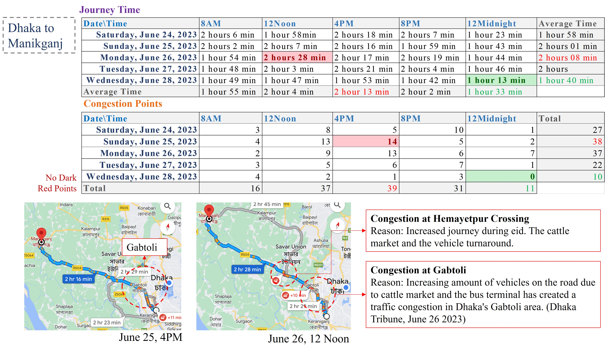
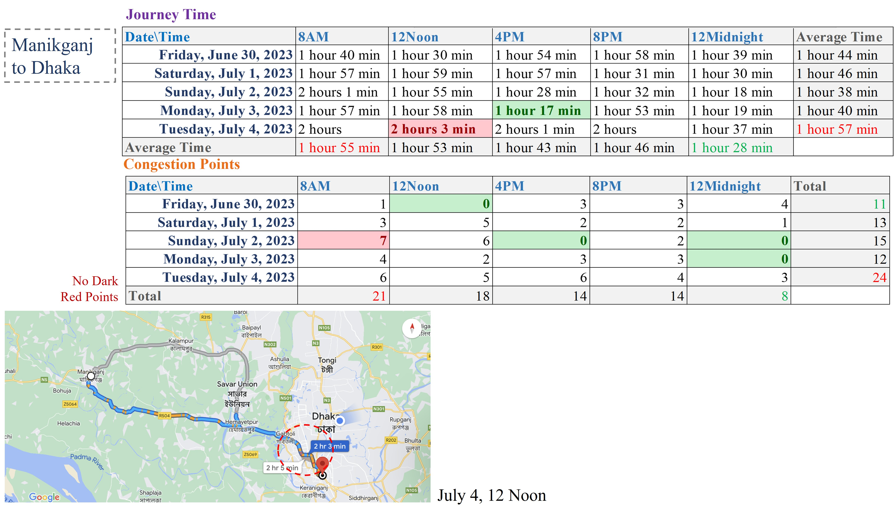

## <i>**Project 1:** Traffic Impact Assessment of an Educational Institution in the Capital City of Bangladesh</i>  

**🎯 Objective:** To identify the impacts of establishing educational institutions on existing traffic conditionc 

    

- **Location of the Study Area**
  

    
  

- **Existing Road Network**
  

    
  

- **Congestion Condition**
  

    
  

  

    
  

- **Traffic Count**
  

    
  

  

    
  

- **Traffic Flow**
  

    
  

- **Modes Used by Students**
  

    
  

- **Pedestrian Count**
  

    
  

- **Level of Service**
  

    
  

- **Proposed Intervention**
  

    
  

    

    
  

    

    
  

 

## <i>**Project 2:** Accessibility and Safety Audit for Persons with Disabilities at University Campus</i>  

**🎯 Objective:** To systematically evaluate the university campus’s accessibility and safety for persons with disabilities against accessibity and safety indicators and applicable national codes.  

   

  - **Accessibility and Safety Audit - Survey Findings**
  

    
  

  

    
  

  

    
  

    

    
  

  

    
  

  

    
  

  

    
  

  

 

## <i>**Project 2:** Experience Trip and Mode Choices</i>  

**🎯 Objective:** To assess mode availability and justify route-specific mode choices using indicators of accessibility, cost, and comfort/safety.  

  
 

## <i>**Project 3:** Highway Conditions during Eid Festivals in Bangladesh</i>  

**🎯 Objective:** To observe highway traffic conditions during eid festivals using Google Map 

- **Highway Condition: Dhaka-Manikganj Route**
  

    
  

   

    
  

- **Highway Condition: Dhaka-Munshiganj Route**
  

    
  

   

    
  

  
 
