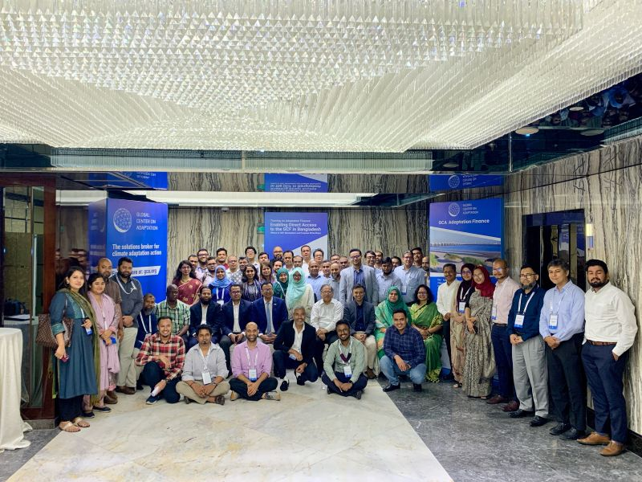
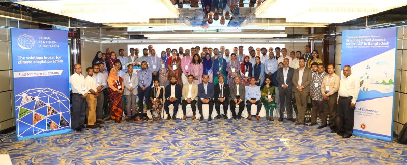

**💼 Designation** - Program Coordinator  

**🥇 Program** - Training on Adaptation Finance: Accessing Green Climate Fund (GCF)  

**🏢 Organization** - <a href="https://gca.org/about-us/regional-offices/gca-south-asia/" target="_blank">Global Center on Adaptation (GCA)</a> 

🗓️ September 2024 – November 2024

---

**📋Key Reponsibilities**  

- **Event & Logistical Support** – Assist Senior Program Officer in organizing events, focusing on logistics, venues, catering, and accommodation. 
- **Communication Materials** – Prepare concept notes, website briefs, banner content, and media materials. 
- **Participant Coordination** – Select, confirm, and coordinate with participants; manage communication, reading material distribution, and logistics. 
- **Assessment & Evaluation** – Evaluate participants’ assignments and prepare detailed evaluation sheets. 
- **Agenda & Reports** – Support development of program agenda and prepare comprehensive training/workshop reports. 
- **Resource Person Support** – Develop Q&A lists for panelists; arrange and manage smooth online sessions. 
- **Event Management Firm (EMF) Liaison** – Coordinate with EMF for procurement, quality assurance, timely delivery, and cost documentation. 
- **Onsite Coordination** – Ensure smooth physical attendance and provide support during events. 

---

### 👥 Training on Adaptation Finance: Enabling Direct Access to the GCF in Bangladesh (Phase II: GCF Mechanism and Proposal Write shop)

  

### 🧾 Program Description**  

The goal of GCA’s training on Adaptation Finance is to develop sustainable capacity of Access Entities, Executing Entities and Adaptation Experts to better design adaptation concept notes and funding proposals for the GCF.  GCF resources are allocated based on the ability of a proposed activity to demonstrate “its potential to adapt to the impacts of climate change in the context of promoting sustainable development and a paradigm shift and the urgent and immediate needs of vulnerable countries”. Project proposals submitted to the GCF must sufficiently demonstrate therefore the need for climate finance and include science-based evidence that the problems to be addressed through the proposed intervention are driven by climate change and climate variability. Project proponents must therefore include a strong climate rationale to explain, as clearly as possible, the climate impacts or risks that the proposed activities address.   
The second phase of the training program on adaptation finance is focused on building the participants’ capacity to develop GCF concept notes for the selective projects identified in NAP. In the first phase, the participants gained a basic knowledge on basic GCF and funding mechanism. In the second phase, the participants will obtain strong understanding and clarity about GCF modalities, approval process and funding mechanism. 

