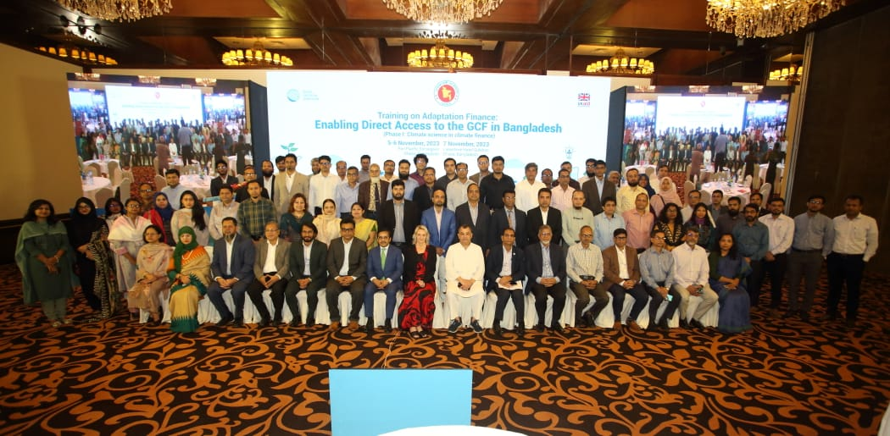

**💼 Designation** - Intern  

**🥇 Designated Program** - Locally Led Adaptation & Climate Adaptation Finance 

**🏢 Organization** - <a href="https://gca.org/about-us/regional-offices/gca-south-asia/" target="_blank">Global Center on Adaptation (GCA)</a> 

🗓️ October 2023 – November 2023

---

**Key Responsibilities:**

**• Locally Led Adaptation Program** 

 - Preparation of transcripts on climate change impacts on lives and livelihoods of marginalized people in northern and southern districts on Bangladesh and their adaptation efforts.
 <a href="https://llahub.gca.org/articles/2afa87fd-6b02-470d-8954-68bea07a6d2e" target="_blank">Givining Voice to the Vulnerable</a> 
 - Primary research on the role of local governments in facilitating climate change adaption in Bangladesh. 

**• Adaptation Finance Program**
- Assisted in organizing trainings and preparing report for the program on “Training Program on Climate Change Adaption Finance Phase 01: Enabling Direct Access to Global Climate Fund.”

### 👥 Masterclass on Adaptation Finance: Enabling Direct Access to GCF in Bangladesh (Phase-I: Climate Science in Climate Finance)

  

### 🧾 Program Description  

The goal of GCA’s training on Adaptation Finance is to develop sustainable capacity of Access Entities, Executing Entities and Adaptation Experts to better design adaptation concept notes and funding proposals for the GCF.  GCF resources are allocated based on the ability of a proposed activity to demonstrate “its potential to adapt to the impacts of climate change in the context of promoting sustainable development and a paradigm shift and the urgent and immediate needs of vulnerable countries”. Project proposals submitted to the GCF must sufficiently demonstrate therefore the need for climate finance and include science-based evidence that the problems to be addressed through the proposed intervention are driven by climate change and climate variability. Project proponents must therefore include a strong climate rationale to explain, as clearly as possible, the climate impacts or risks that the proposed activities address.   
