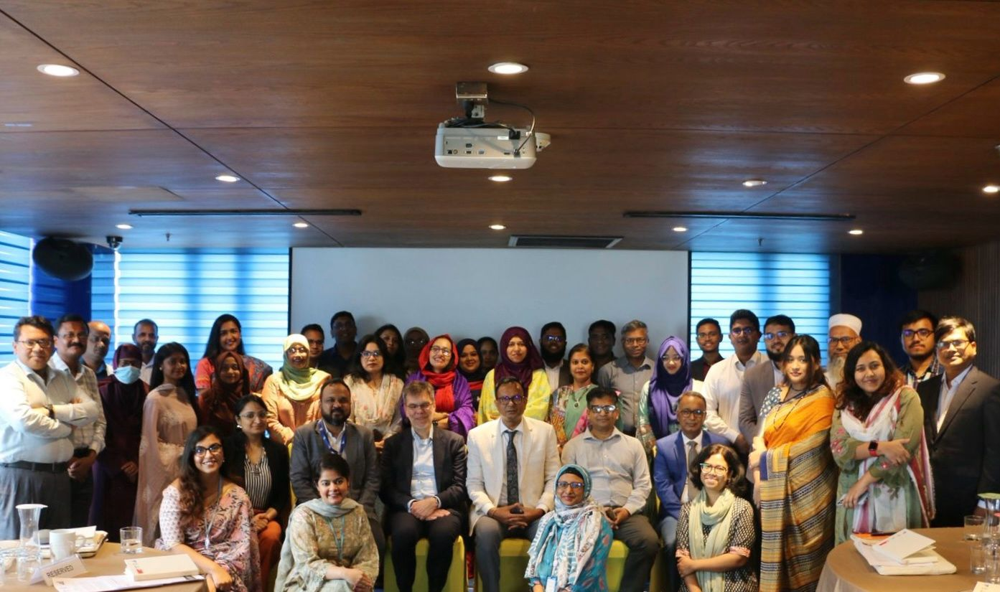
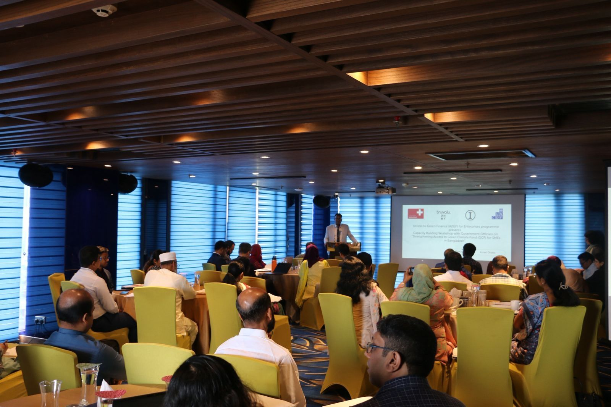
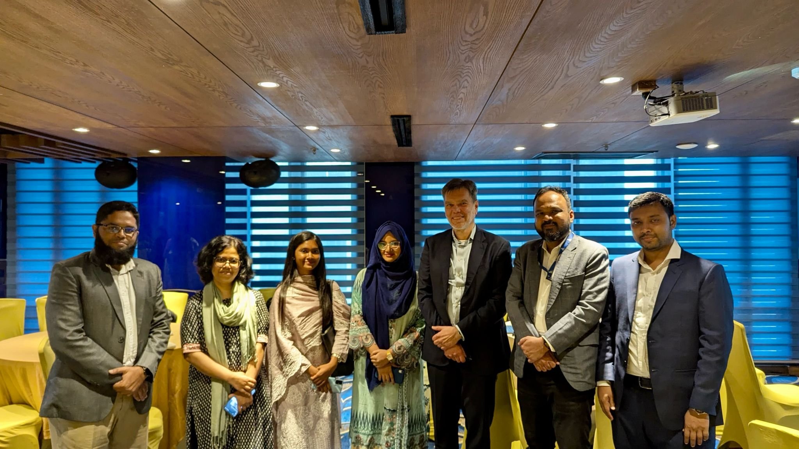

**💼 Designation** - Climate Associate 

**🏢 Organization** - <a href="https://www.iwmbd.org/" target="_blank">Institute of Water Modelling (IWM)</a> 

🏷️ Deputation at the <b><a href="https://climatefinance.erd.gov.bd/" target="_blank">International Climate Finance Cell (ICFC)</a>, Economic Relations Division (ERD), Ministry of Finance, Government of Bangladesh. </b> 

📍 Dhaka, Bangladesh · 🗓️ Dec 2024 – May 2025

📋Key Reponsibilities

- Preparation of the **First Country Consultation Workshop Report** for the Global Shield In-Country Process (Bangladesh).
- Organization & coordination of national-level events, workshops & trainings.
- Drafted concept notes, official documentation, and high-level **briefing notes** for CFMCA and CVF-V20 side events.
- Research on **carbon markets**, **NDCs**, and global climate finance frameworks; supported content for the International Climate Finance Cell website.
- Leading Stakeholder communication and program logistics across government, development partners, and private sector.

**Highlight:** 🏆 2nd place in the “Capacity Building Workshop with Government Officials on Strengthening Access to the GCF for SMEs in Bangladesh” (May 2025).

  
<b>View Certificate</b>

  

    
  

## 👩🏻‍💻 Arrangement of National-level Events, Workshops & Trainings. 

### Capacity Building Workshop on Strengthening Access to Green Climate Fund in Bangladesh
🗓️ 28–29 May 2025.

  

**🧾 Objective of the Workshop**  

 
• Enhance NDA and DEA’s understanding of GCF’s structure, policies, and funding mechanisms.  
• Build capacity in developing and reviewing high-quality concept notes and technical proposals for GCF funding by sharing best practices and lessons learned.  
• Strengthen government stakeholders' capacity to access and utilise GCF resources effectively and increase their access to SMEs for the green transition.  
• Discuss challenges and common bottlenecks for DAEs to access GCF with case studies and how to overcome them.   
• Present preliminary recommendations and strategies to improve access to the Green Climate Fund (GCF) and facilitate discussions on additional actions needed to strengthen SME access to climate finance in Bangladesh.  

