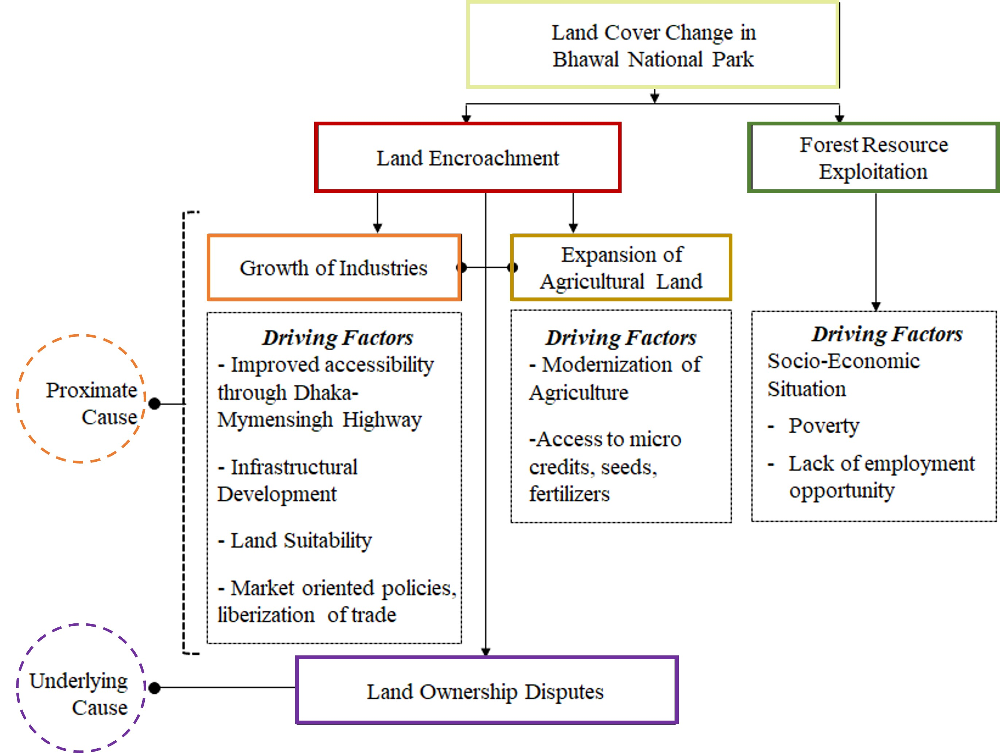

# 📘 Thesis: Exploring the Reasons Behind Land Cover Change & Evaluating Management Strategies of a Protected Area in Bangladesh

## 🎯 Objectives
1. To explore the reasons behind land cover change of a selected protected area in Bangladesh. 
2. To evaluate management strategies for the selected protected area.

## 🛠️ Methodology
 — <i>⬇️ Click the dropdown arrow (▸) to view each content.</i>

  
<a href="#dc"><em>Data Collection</em></a>

  

    
  

  
<a href="#pra"><em>Application of Participatory Rural Appraisal Tools</em></a>

  

    
  

  
<a href="#mett"><em>Application of Management Effectiveness Tracking Tool (METT)</em></a>

  

    
  

## 📊 Results
- <b> Social and Resource Map of the Study Area </b>
  

    
  

   

- <b> Temporal Change in the Study Area </b>
  

    
  

 

- <b> Pair Wise Matrix for Identifying the Major Causes Behind Land Cover Change </b>
  

    
  

 

- <b>Reasons behind Land Cover Changes of the Study Area</b>
  

    
  

 

- <b>Change in Land Ownership of the Study Area</b>
  

    
  

 

- <b>Change in Local Livelihood Options</b>
  

    
  

 

- <b> Identification of Possible Threats to the Study Area & Threat Extent and Severity</b>
  

    
  

 

- <b>Stakeholders Associated with the Management of Bhawal National Park<b>
  

    
  

 

- <b> Percentage of Five Elements of Management Effectiveness of the Study Area</b>
  

    
  

 

## 📌 Major Findings

- The forestlands of Bhawal National Park are gradually encroached through establishing industries, settlements or expanding agricultural lands. 
- At present, 989.36 acres forestlands are illegally encroached by industries, agro based farms or private cottages. The total land valuation of the encroached lands is 197872 crore BDT. 
- The Forest Department have filed 985 eviction cases against the illegal encroachers. Only 326.36 acres (30%) forestlands are restored from the encroachers. 
- Before 2000, the issue of forest resource exploitation was extremely high as the forest resources were the only means of living for the poor people. 
- The management effectiveness of the protected area in only 30.13 percent. The present management system of the protected area is ineffective is conserving forest ecosystem.
- Bangladesh Forest Department has weak institutional capacity to directly enforce the laws against the forest crimes.
- The current management process is excluding the local people from decision-making process and management activities. 

